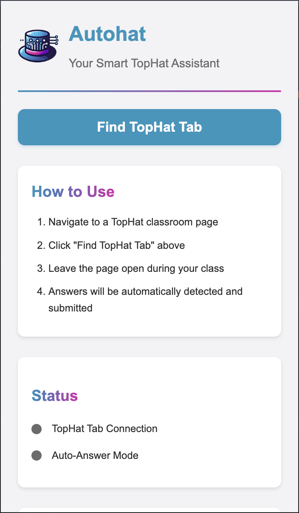

# TopHat Auto-Fill Chrome Extension, TartanHacks2025

## Overview
This Chrome extension automatically answers TopHat questions correctly for classes while you are away from your computer.

## Features
- Auto-detects TopHat questions on active pages
- Fills in answers instantly
- Works seamlessly in the background
- Lightweight and easy to use

## Usage
1. Navigate to a TopHat classroom page.

2. Click the chrome extension icon and select "Find TopHat Tab".

3. Leave the page open for the duration of your class.
4. The extension will automatically detect, answer, & submit answers.

## Demo
_A demo video will be added here soon._

## Disclaimer
This extension is intended for educational and personal use only. Use responsibly and in accordance with your institution's academic policies.

## License
This project is licensed under the MIT License.